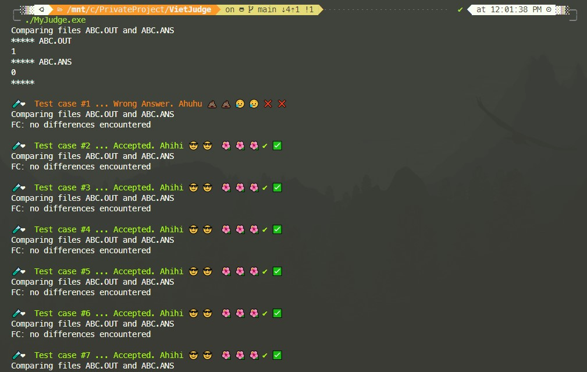

## 1. Intro

Đây là chương trình mà mình thường sử dụng để chấm bài

**Môi trường code**

```
OS: Windows 10

Editor: Visual Studio Code

Terminal: WSL bash (nếu bạn muốn terminal như hình bên dưới thì cài thêm oh-my-zsh và powerlevel10k theme)
(nếu bạn chạy trên cmd, powershell của windows có thể không hiện thị được các icon)

Compiler: gcc version 9.2.0
```



## 2. How does it work?

### Ví dụ

- `ABC.cpp` là code bạn cần chấm, chương trình này sẽ đọc từ file ABC.INP và ghi kết quả vào file ABC.OUT

- `ABC_2.cpp` là code bruteforce mà bạn chắc chắn kết quả của nó đúng. Chương trình này đọc từ file ABC.INP và ghi kết quả vào file ABC.ANS

- Compile file ``ABC.cpp`` thành ``ABC.exe`` và ``ABC_2.cpp`` thành ``ABC_2.exe``

- ``MyJudge.cpp`` là code chính để chấm bài, sau đây là flow của nó:
  - Hàm `tcgenerator()` dùng để sinh ra các test case và ghi vào file ABC.INP (với mỗi bài khác nhau sẽ cần viết lại hàm này để nó random ra input tương ứng )
  - Gọi thực thi ABC.exe, ABC_2.exe --> kết quả sẽ được ghi vào hai file ABC.OUT, ABC.ANS
  - So sánh hai file này với nhau sẽ biết đúng/sai ở test case nào (windows cung cấp lệnh `fc` để so sánh file, `fc` là viết tắt của `file compare`)


```
Tham khảo: https://vnoi.info/wiki/algo/skill/viet-trinh-cham.md
```
